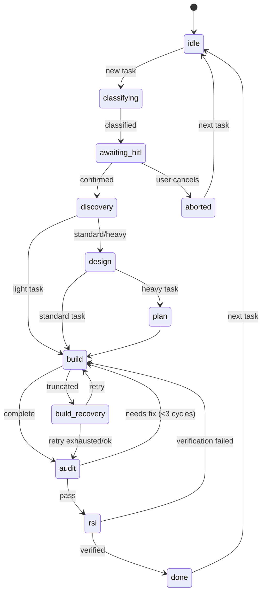
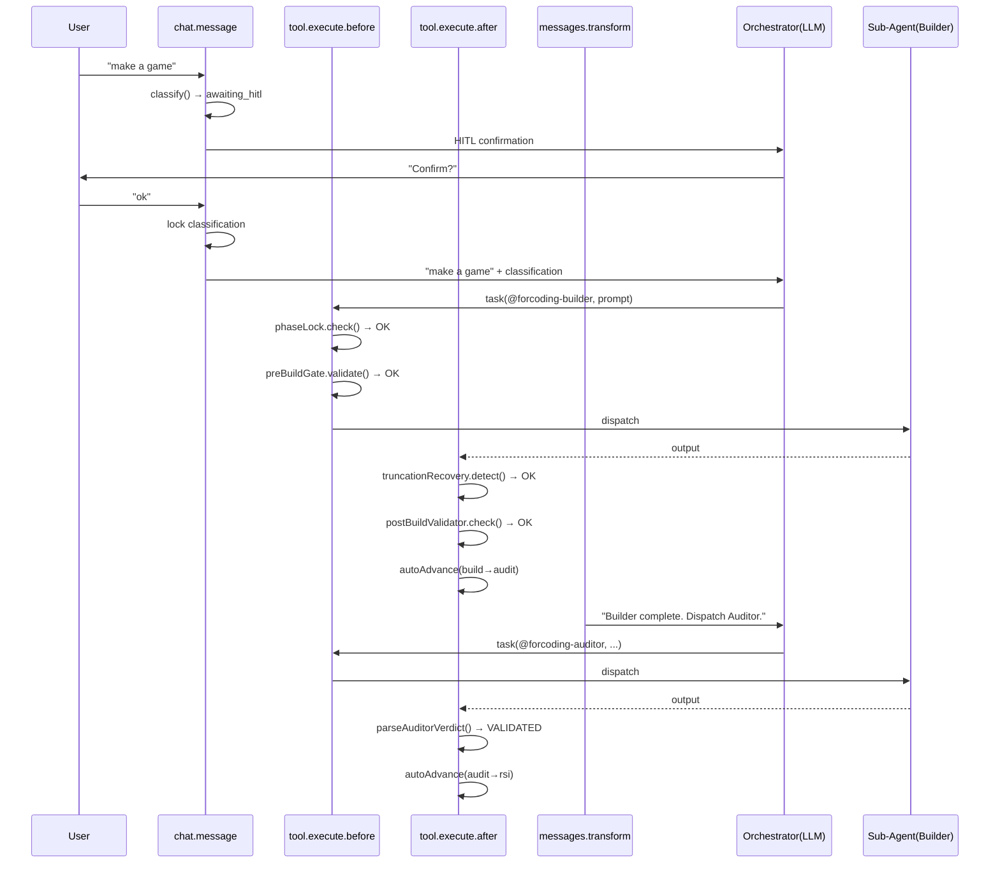
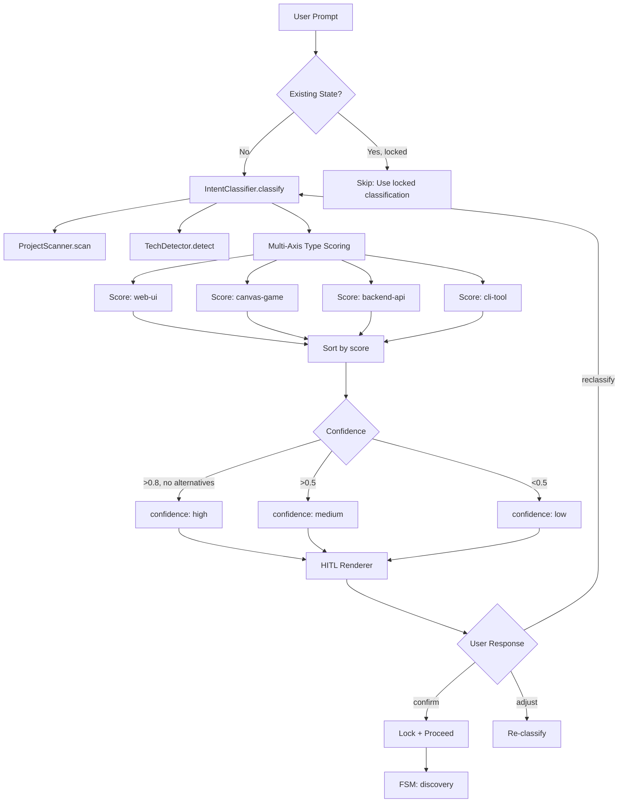

# ForCoding_Arch Design Audit — Gaps & Fixes

> **Audit Date:** 2026-06-09  
> **Auditor:** Pre-implementation final review  
> **Verdict:** 2 bugs + 8 missing specs + 3 missing files → **Fixable, proceed after corrections**

---

## 1. Design Bugs Found

### BUG-1: Double transition in Auditor dispatch flow

**Location:** DESIGN.md §2.3 Data Flow, line 231-232

**Problem:**
```
line 223: fsm.autoAdvance('build', 'audit')  // Post-Builder: advances to 'audit'
line 232: fsm.transition('build', 'audit')    // Pre-Auditor: tries to transition FROM 'build'
```
By line 232, the state is already 'audit' (set by autoAdvance). `transition('build', 'audit')` would throw because current state ≠ 'build'.

**Fix:** Remove line 232. In Pre-Auditor hook, only run phase-lock check (state should already be 'audit').

```javascript
// CORRECTED: tool.execute.before for auditor
'tool.execute.before': async (input, output) => {
  if (tool === 'task' && output.args?.subagent_type === 'forcoding-auditor') {
    const state = await store.load(input.sessionID);
    // State should already be 'audit' from autoAdvance
    // Only verify, don't re-transition
    if (state.currentState !== STATE.AUDIT) {
      throw new Error(`[ForCoding] Auditor requires state=audit, current=${state.currentState}`);
    }
  }
}
```

### BUG-2: Auditor output not parsed for PASS/FAIL

**Location:** DESIGN.md §2.3 Data Flow, line 237-243

**Problem:** The data flow shows "Auditor output analyzed: PASS / NEEDS_FIX / FAIL" and branching logic, but the plugin entry code unconditionally calls `autoAdvance('audit', 'rsi')`.

**Fix:** Parse auditor output summary for verdict keyword, branch accordingly.

```javascript
'tool.execute.after': async (input, output) => {
  if (tool === 'task' && input.args?.subagent_type === 'forcoding-auditor') {
    const verdict = parseAuditorVerdict(output.output);
    
    if (verdict === 'VALIDATED' || verdict === 'PASS') {
      await fsm.autoAdvance('audit', 'rsi');
      output.title = '[AUDIT PASS → RSI QUEUED]';
    } else if (verdict === 'PARTIAL' || verdict === 'NEEDS_FIX') {
      await cycleDetector.check('audit');
      await fsm.transition('audit', 'build');
      output.title = `[AUDIT: NEEDS FIX → BUILD ROUND ${fsm.buildRound + 1}]`;
    } else {
      // FAIL or unparseable → HITL escalation
      await store.save({ auditFailed: true, auditOutput: output.output });
      output.title = '[AUDIT FAIL → HITL REQUIRED]';
    }
  }
}

function parseAuditorVerdict(output) {
  // Look for structured verdict in auditor output
  if (/VERDICT:\s*VALIDATED/i.test(output)) return 'VALIDATED';
  if (/VERDICT:\s*PARTIAL/i.test(output)) return 'PARTIAL';
  if (/VERDICT:\s*INVALIDATED/i.test(output)) return 'INVALIDATED';
  // Fallback: keyword matching
  if (/all.*checks.*pass|no.*critical.*issues/i.test(output)) return 'PASS';
  if (/needs.*fix|requires.*change/i.test(output)) return 'NEEDS_FIX';
  return 'UNKNOWN';
}
```

---

## 2. Missing Module Specifications

### MISS-1: `state-store.js` API

```javascript
// src/fsm/state-store.js

class StateStore {
  constructor(projectDir) {
    this.baseDir = path.join(projectDir, 'docs', 'forcoding', 'state');
  }

  // Load state for a session. Returns {} if no file exists.
  async load(sessionId) { ... }

  // Save full state (atomic: write .tmp → rename)
  async save(data) { ... }

  // Merge partial update into existing state
  async update(partialData) { ... }

  // Lock classification (prevents re-classification)
  async lock(state) {
    await this.update({ classificationLocked: true });
  }

  // Archive completed session state
  async archive(sessionId) { ... }

  // Delete state file
  async delete(sessionId) { ... }

  // Get raw state object (in-memory cache)
  get() { return this._cache; }
}
```

### MISS-2: `cycle-detector.js` API

```javascript
// src/enforcer/cycle-detector.js

class CycleDetector {
  constructor(stateStore) {
    this.store = stateStore;
    this.MAX_CYCLES = 3;  // Max build→audit→build loops
  }

  // Called before transitioning audit→build
  // Throws if cycle limit exceeded
  check(stage) {
    const state = this.store.get();
    const cycles = (state.auditCycles || 0) + 1;

    if (cycles > this.MAX_CYCLES) {
      throw new CycleLimitExceededError(
        `Build→Audit→Build cycle limit (${this.MAX_CYCLES}) exceeded. HITL required.`
      );
    }

    this.store.update({ auditCycles: cycles });
  }

  // Reset cycle counter on successful audit
  reset() {
    this.store.update({ auditCycles: 0 });
  }
}
```

### MISS-3: `tool-allowlist.js` API

```javascript
// src/enforcer/tool-allowlist.js

class ToolAllowlist {
  // Returns allowed tools for a given phase
  static forPhase(phase) {
    const MAP = {
      [STATE.IDLE]:            ['read', 'glob', 'grep', 'bash:git*', 'task'],
      [STATE.CLASSIFYING]:     ['read', 'glob', 'grep', 'bash:git*'],
      [STATE.AWAITING_HITL]:   [],  // No tools — waiting for user
      [STATE.DISCOVERY]:       ['read', 'glob', 'grep', 'task', 'write', 'edit'],
      [STATE.DESIGN]:          ['read', 'glob', 'grep', 'task', 'write'],
      [STATE.PLAN]:            ['read', 'glob', 'grep', 'task', 'write'],
      [STATE.BUILD]:           ['task'],  // Only dispatchable — no direct write/edit
      [STATE.BUILD_RECOVERY]:  ['task'],
      [STATE.AUDIT]:           ['task', 'read', 'glob', 'grep'],
      [STATE.RSI]:             ['read', 'playwright*', 'task'],
      [STATE.DONE]:            ['read', 'bash:git*'],
    };
    return MAP[phase] || [];
  }

  // Check if a tool is allowed in current phase
  static isAllowed(tool, phase) {
    const allowed = this.forPhase(phase);
    return allowed.some(pattern => {
      if (pattern === '*') return true;
      if (pattern.endsWith('*')) return tool.startsWith(pattern.slice(0, -1));
      return pattern === tool;
    });
  }
}
```

### MISS-4: `health-check.js` API

```javascript
// src/observability/health-check.js

class HealthCheck {
  // Verify all hooks are registered and functional
  static async run(pluginHooks) {
    const results = [];

    // Check required hooks exist
    const requiredHooks = [
      'chat.message',
      'tool.execute.before',
      'tool.execute.after',
      'experimental.chat.messages.transform',
    ];

    for (const hook of requiredHooks) {
      results.push({
        hook,
        present: typeof pluginHooks[hook] === 'function',
        status: typeof pluginHooks[hook] === 'function' ? 'OK' : 'MISSING',
      });
    }

    // Check state directory is writable
    // Check gate directory is writable
    // Check audit directory is writable

    return {
      allPassed: results.every(r => r.present),
      results,
      timestamp: Date.now(),
    };
  }
}
```

### MISS-5: `metrics.js` API

```javascript
// src/observability/metrics.js

class Metrics {
  constructor(stateStore) {
    this.store = stateStore;
  }

  // Track metrics for this session
  track(event, data) {
    const state = this.store.get();
    const metrics = state._metrics || {};

    switch (event) {
      case 'dispatch':    metrics.dispatchCount = (metrics.dispatchCount || 0) + 1; break;
      case 'blocked':     metrics.blockedCount = (metrics.blockedCount || 0) + 1; break;
      case 'truncation':  metrics.truncationCount = (metrics.truncationCount || 0) + 1; break;
      case 'cycle':       metrics.cycleCount = (metrics.cycleCount || 0) + 1; break;
      case 'hitl':        metrics.hitlCount = (metrics.hitlCount || 0) + 1; break;
    }

    this.store.update({ _metrics: metrics });
  }

  // Get compliance rate
  getComplianceRate() {
    const m = this.store.get()._metrics || {};
    const total = (m.dispatchCount || 0) + (m.blockedCount || 0);
    if (total === 0) return 100;
    return ((m.dispatchCount / total) * 100).toFixed(1);
  }
}
```

### MISS-6: `subtype-validator.js` API

```javascript
// src/classifier/subtype-validator.js

class SubtypeValidator {
  // Validate tag consistency
  // e.g., domain=game + form=library → inconsistent
  static validate(tags) {
    const errors = [];

    // Domain-form compatibility
    if (tags.domain === 'game' && ['library', 'api'].includes(tags.form)) {
      errors.push(`Inconsistent: domain=game incompatible with form=${tags.form}`);
    }
    if (tags.domain === 'cli' && ['spa', 'app'].includes(tags.form)) {
      errors.push(`Inconsistent: domain=cli incompatible with form=${tags.form}`);
    }

    // Framework-domain compatibility
    if (tags.domain === 'frontend' && tags.framework === 'express') {
      errors.push(`Inconsistent: Express is a backend framework`);
    }

    // Lifecycle-domain compatibility
    if (tags.lifecycle === 'hotfix' && tags.domain === 'data') {
      errors.push(`Hotfix mode may not apply to data pipelines`);
    }

    return { valid: errors.length === 0, errors };
  }
}
```

### MISS-7: `state-store.js` file path pattern

```
docs/forcoding/state/{sessionId}.json

Example: docs/forcoding/state/ses_abc123def.json
```

Atomic write pattern:
```javascript
async save(data) {
  const filePath = path.join(this.baseDir, `${data.sessionId}.json`);
  const tmpPath = filePath + '.tmp';
  
  // Ensure directory exists
  await fs.mkdir(this.baseDir, { recursive: true });
  
  // Write to temp file
  await fs.writeFile(tmpPath, JSON.stringify(data, null, 2), 'utf8');
  
  // Atomic rename
  await fs.rename(tmpPath, filePath);
  
  // Update cache
  this._cache = { ...data };
}
```

### MISS-8: Multi-session conflict resolution

```javascript
// In state-store.js
async load(sessionId) {
  // Each sessionId is isolated. No cross-session locking needed.
  // If two OpenCode sessions on same project, they get different sessionIds.
  // State files: ses_001.json and ses_002.json — never conflict.
  
  const filePath = path.join(this.baseDir, `${sessionId}.json`);
  try {
    const raw = await fs.readFile(filePath, 'utf8');
    this._cache = JSON.parse(raw);
    return this._cache;
  } catch (e) {
    if (e.code === 'ENOENT') {
      this._cache = { sessionId };
      return this._cache;
    }
    throw new StateCorruptionError(`Cannot read state for ${sessionId}: ${e.message}`);
  }
}
```

---

## 3. Missing Files

### FILE-1: `ForCoding_Arch/diagrams/fsm-states.mermaid`



### FILE-2: `ForCoding_Arch/diagrams/plugin-hooks-flow.mermaid`



### FILE-3: `ForCoding_Arch/diagrams/classifier-flow.mermaid`



---

## 4. Fix Checklist

| ID | Type | File | Fix |
|:--|:--|:--|:--|
| BUG-1 | Bug | DESIGN.md §2.3 line 232 | Remove double transition; add state verification only |
| BUG-2 | Bug | DESIGN.md §2.3 line 237-243 | Add `parseAuditorVerdict()` with branching |
| MISS-1 | Missing | DESIGN.md §4 | Add StateStore API specification |
| MISS-2 | Missing | DESIGN.md §7 | Add CycleDetector API |
| MISS-3 | Missing | DESIGN.md §7 | Add ToolAllowlist API |
| MISS-4 | Missing | DESIGN.md §2 | Add HealthCheck API |
| MISS-5 | Missing | DESIGN.md §2 | Add Metrics API |
| MISS-6 | Missing | DESIGN.md §5 | Add SubtypeValidator API |
| MISS-7 | Missing | DESIGN.md §4 | Add file path pattern + atomic write |
| MISS-8 | Missing | DESIGN.md §4 | Add multi-session note |
| FILE-1 | Missing | ForCoding_Arch/diagrams/ | Create FSM state diagram |
| FILE-2 | Missing | ForCoding_Arch/diagrams/ | Create plugin hooks sequence diagram |
| FILE-3 | Missing | ForCoding_Arch/diagrams/ | Create classifier flow diagram |
